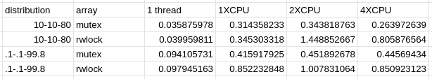

Ejercicio 40 [array_thrsafe_perf]
Copie sus dos implementaciones del arreglo dinámico thread-safe de los dos ejercicios anteriores a la carpeta array_thrsafe_perf. Renombre los símbolos y archivos de la implementación con mutex del prefijo array_ por array_mutex_ y la implementación con candados de lectura y escritura para iniciar con el prefijo array_rwlock_. De esta forma, las dos implementaciones pueden coexistir en un mismo ejecutable. Para probarlas puede usar el siguiente programa:

array_thrsafe_perf/main.c

El programa de pruebas anterior recibe siete argumentos en la línea de comandos:

La cantidad inicial de elementos en el arreglo (size_t).

La cantidad de operaciones a realizar en el arreglo (size_t).

El porcentaje de operaciones que son inserciones en el arreglo (double).

El porcentaje de operaciones que son eliminaciones en el arreglo (double).

El porcentaje de operaciones que son búsquedas en el arreglo (double).

La cantidad de trabajadores (threads) a probar (size_t).

El arreglo a probar ("mutex" o "rwlock").

De acuerdo al último argumento, el hilo principal crea un arreglo thread-safe protegido por un mutex o por un candado de lectura-escritura (rwlock). Luego el hilo principal inserta la cantidad inicial (primer argumento) de elementos aleatorios en el arreglo.

Luego el programa lanza la cantidad de hilos indicada en el sexto argumento. Los hilos se reparten la cantidad de operaciones indicada en el segundo argumento. Cada hilo procura distribuir sus operaciones sobre el arreglo de acuerdo a los porcentajes dados en los argumentos tres a seis. Los hilos escogen estas operaciones al azar, sin ningún orden definido.

Verifique que el programarealice las operaciones sin fugas de memoria o accesos inválidos. Haga varias corridas para replicar los experimentos de (Pacheco 2011 pp.188-9). Con la herramienta gprof (si lo prefiere puede usar perf) mida la duración de cada corrida.

Para ambos experimentos cree arreglos con 1000 elementos iniciales y realice un millón de operaciones con 1 hilo, 1xCPU, 2xCPU, y 4xCPU, donde CPU es la cantidad de CPU disponibles en la máquina donde realiza las pruebas. En el primer experimento realice 10% de inserciones, 10% de eliminaciones, y 80% de búsquedas en el arreglo. Para el segundo experimento realice 0.1% de inserciones, 0.1% de eliminaciones, y 99.8% de búsquedas. Anote las duraciones de cada corrida en una hoja de cálculo con la siguiente estructura:

Tabla 29. Duraciones
threads

distribution

array

1 thread

1xCPU

2xCPU

4xCPU

10-10-80

mutex

rwlock

.1-.1-99.8

mutex

rwlock

Elabore en su hoja de cálculo un gráfico con cuatro series (una por cada fila) que permita comparar el rendimiento de los mutex contra los candados de lectura-escritura (rwlock). ¿En qué circustancia recomendaría usted usar candados de lectura y escritura? Responda con un comentario en la celda "rwlock" correspondiente.

Basado en los resultados de las pruebas, el uso de mutex resultó ser más rápido en todos los casos, por ende, al menos basandose en estas pruebas, se puede decir que siempre es el control de concurrencia a utilizar entre los dos. A pesar de estos resultados, debido a utilizarse pruebas muy breves, la conclusión dada no puede ser considerada como definitiva, ya que los resultados también dependen de la implementación. 