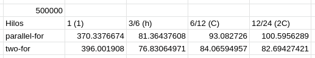
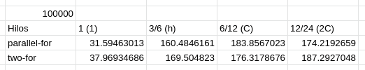

Ejercicio 51 [odd_even_sort_perf]
Con la herramienta perf mida el tiempo de ejecución de su implementación serial, parallel-for, y two-for del algoritmo de ordenamiento par-impar con un millón de elementos. Anote las duraciones obtenidas en una hoja de cálculo, con 1 hilo (1), tantos hilos como la mitad de CPUs disponibles (h) en el sistema, igual a la cantidad de CPUs (C), y dos veces la cantidad de CPUs disponibles (2C) en la máquina donde se realizaron las pruebas, la cual debe tener al menos 8 núcleos.

Sin controles de concurrency en el metodo swap(). 

Con controles de concurrencia en el metodo swap(). Debido estos controles, gran parte se encuentra serializada y por ende incrementa el tiempo de ejecucion, en conjunto con el incremento del numero de hilos concurrentes. 