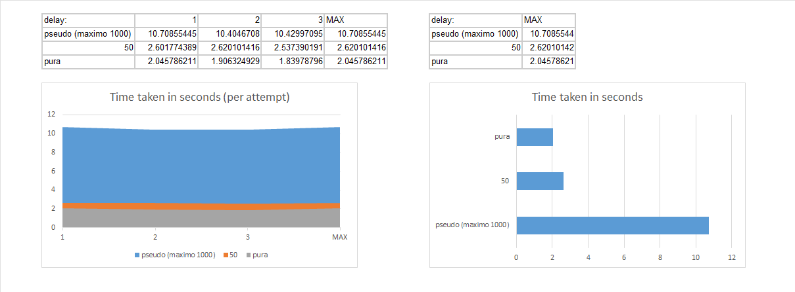

Ejercicio 12 [delayed_busy_wait]
Espera activa con retraso. ¿Se corrige el problema de la espera activa si en lugar de tener un ciclo vacío, se espera un cierto tiempo? Copie su carpeta ejemplos/pthreads/hello_order_busywait a ejercicios/pthreads/delayed_busy_wait. Permita que el usuario pueda invocar su programa dos argumentos de línea de comandos: la cantidad de hilos a crear, y la cantidad de microsegundos a esperar cuando no es el turno del hilo de ejecución.

Espera activa con retraso constante. Si no es el turno de un hilo, éste espera una cantidad constante de microsegundos, algo como:

// Constant delayed busy waiting: wait until it is my turn
while (next_thread < my_thread_id) {
  usleep(delay);
}
Recuerde probar la calidad de su código (sanitizers, linter). Luego ejecute al menos tres veces su solución (sin sanitizers) con la cantidad máxima de hilos de ejecución que su sistema operativo le permite crear y una espera de 50µs. Escriba en el readme.md del ejercicio la mayor de las duraciones que obtuvo de sus corridas. ¿Hubo una mejora de la espera constante respecto a la espera activa pura?

Espera activa con retraso pseudoaleatorio. Altere su solución al ejercicio para que en lugar de esperar exactamente la cantidad de microsegundos indicada por el usuario, espere por una cantidad pseudoaleatoria de microsegundos cuyo límite es el número indicado por el usuario en el segundo argumento de línea de comandos. Sugerencia: puede usar compilación condicional para implementar esta variación. La espera varía en cada iteración del ciclo de espera activa, algo como:

// Random delayed busy waiting: wait until it is my turn
while (next_thread < my_thread_id) {
	const unsigned my_delay = rand_r(&my_seed) % max_delay;
  usleep(my_delay);
}
Ejecute al menos tres veces su solución pseudoaleatoria con la cantidad máxima de hilos y un máximo de espera de 50µs. Tome la mayor de las duraciones. ¿Hubo una mejora de la espera pseudoaleatoria respecto a la espera constante?

Nota: El ejercicio cambió entre la realización y la copia de el enunciado a este documento.

Detalles de computadora: 
OS:popOs
CPU: Ryzen 5 3600 (6 nucleos fisicos y 12 logicos) a 4.2 Ghz
RAM: 16 Gb 3600

Dentro de los tiempos de ejecucion, el mas breve resultó ser el de la espera activa pura. Definir la un sleep de 50µs resultó en tiempos marginalmente mayores, mientras que utilizar numeros pseudoaleatorios con un maximo de 1000µs dió tiempos 5 veces más altos a los otros. Basado en los resultados parecería que agregar un retraso dentro de la espera activa resulta en un tiempo de ejecución mayor. A pesar de esto se tiene que tomar en cuenta que cada intento fue realizado extremadamente breve, y aunque fueron con la cantidad maxima de hilos permitidos por el sistema, al ser de tal brevedad, con solo 3 intentos, estos datos no podrían dar suficiente confianza para hayar una conclusión más concreta. 