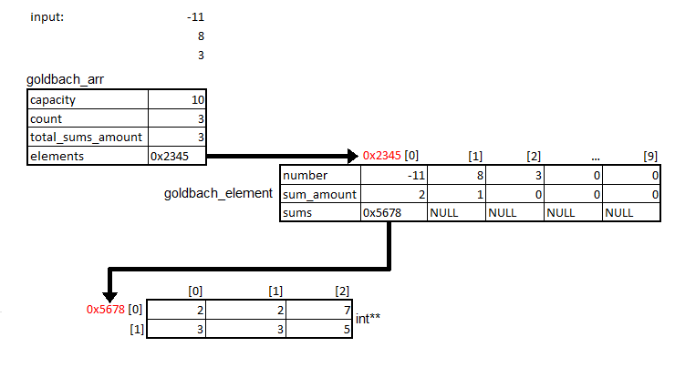

= Design =

Design of the solution that is implemented.

== Data Structure ==

[#img-Diagrama de memoria.png]

The main data structure is the "goldbach_arr", a dynamic array holding what we will call the "goldbach_element". What goldbach_arr holds, however, is a pointer address to the array itself. This address begining at this address holds each of the goldbach_elements in the goldbach_arr. 

The goldbach_element(s) will hold the number, the amount of sums and a pointer address to an array of sums. This array, however does not holds the sums themselves, instead the adresses to the location of the sums themselves stored in arrays themselves. 

[#img-C0117-T1.png]

The goldbach_element(s) will each hold the number to be (or already) processed, the amount of sums found and a 2D array holding the sums. 

The goldbach_arr contains a array of goldbach_element(s). The goldbach_arr will hold its capacity or space available, its count or amount of elements added, the total amount of sums found already and the goldbach_element(s).

== Pseudocode ==

=== main ===

[section, c]

=== golbach_conjecture ===

[section, c]

=== goldbach_arr ===

[section, c]