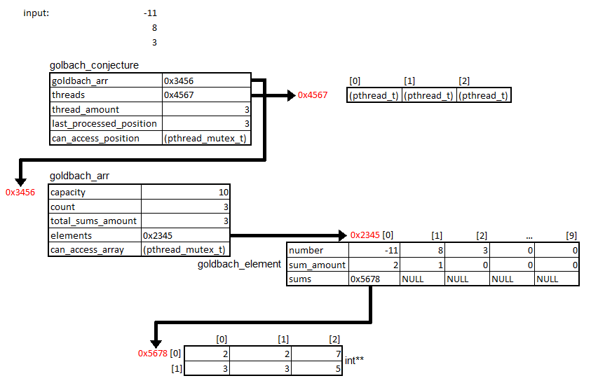
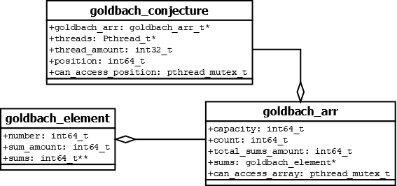
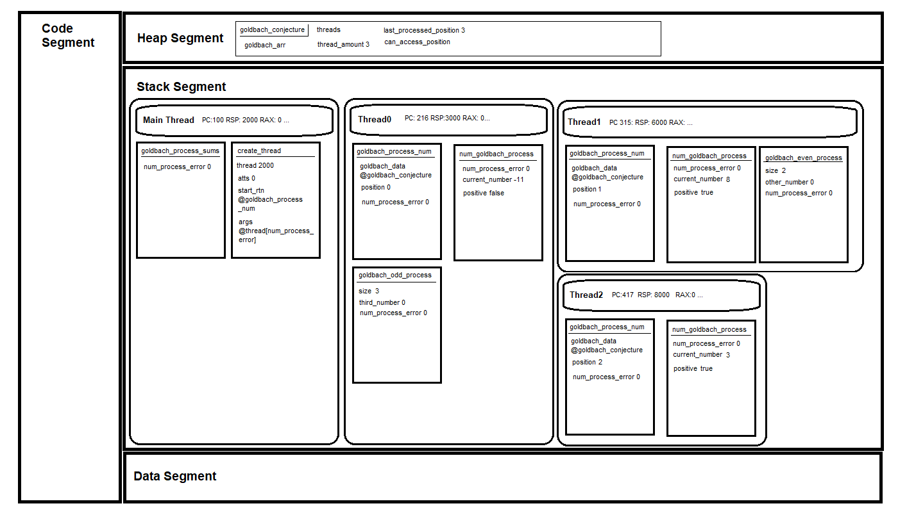

= Design =

Design of the solution that is implemented.

== Data Structure ==

[#img-Diagrama de memoria.png]

The main data structure is the goldbach_conjecuture , which holds the goldbach_arr, the threads for concurrency, the amount of threads to be created, the position of the last number processed, and the mutex to access said position. It could be considered the brain that manages the information for processing, as well as the results and other necessary data for efficient processing that is not directly related to the goldbach numbers and as such not part of the goldbach_arr struct. 

The dynamic array "goldbach_arr" holds what we will call the "goldbach_element". What goldbach_arr holds, however, is a pointer address to the array itself. This address begining at this address holds each of the goldbach_elements in the goldbach_arr. 

The goldbach_element(s) will hold the number, the amount of sums and a pointer address to an array of sums. This array, however does not holds the sums themselves, instead the adresses to the location of the sums themselves stored in arrays themselves. 

[#img-C0117-T1.png]

The goldbach_element(s) will each hold the number to be (or already) processed, the amount of sums found and a 2D array holding the sums. 

The goldbach_arr contains a array of goldbach_element(s). The goldbach_arr will hold its capacity or space available, its count or amount of elements added, the total amount of sums found already and the goldbach_element(s).

[#img-Thread_mem_tracing.png]

Memory representation of the thread management. Main thread spans as many threads as either the amount of numbers in the array, or the amount of threads directed. It will do the least of them. Most of the data is handled by the shared data struct named "goldbach_conjecture" and little on each subroutine itself. Notice how on thread2 as the number does not require processing, will not call an unecessary subroutine. 

== Pseudocode ==

=== main ===

include::main.pseudo[]

=== golbach_conjecture ===

include::goldbach_conjecture.pseudo[]

=== goldbach_arr ===

include::goldbach_arr.pseudo[]