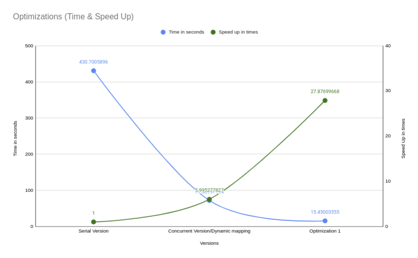
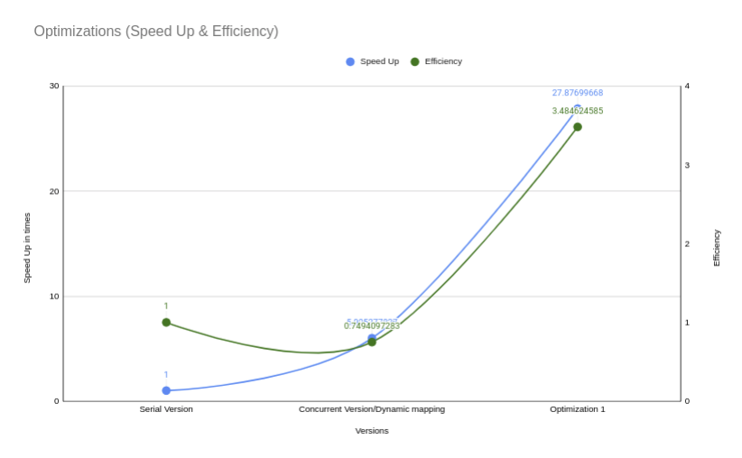
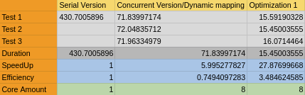
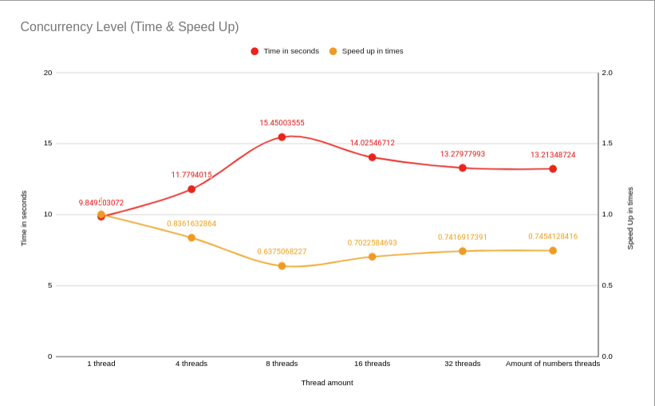
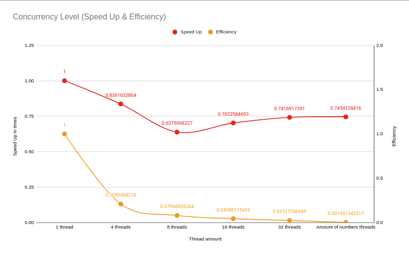
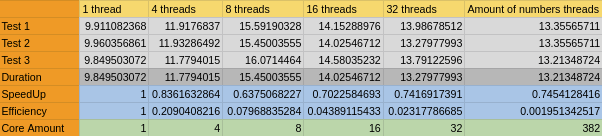

= Report =

== Summary ==

All tests were done on the Arenal cluster. The unit used was unit 0, which at the time was confirmed to have had no other users at the moment. The device counts with a CPU which has 8 cores and 8 threads. 

The test used was input029.txt, which is a combination of all small and medium tests in single file for testing. The amount of numbers for testing in this file is 382.

== Optimization 1: serial ==

=== Design ===

Most of the time processing the goldbach sums was found to be spent on calculating prime numbers. Aside from this, for every sum, every number had to be calculated to check if it was prime, and this for every number whose sums was to found. As a result, 2 optimizations were chosen as needed: to better calculate or find the prime numbers, and to only do so once.

For the first point, of increasing the efficiency of the prime number search, instead of a prime number seach where each number was checked for primality, a sieve was chosen. Sieves are found to be the most time efficient way to find large amount of prime numbers and the chosen sieve, the sieve of Atkins, has an O time of O(n). The only caveat would be the large amount of space necessary to store said numbers, as these are stored in an array of bools. Since this array stores wether a number is prime or not, each access is a simple O(1). In the case where the memory could not be allocated to store this array, the system would default to the previous primality test method.

For the second point on only calculating said numbers next, the previously mentioned array would be created once at the begining of execution and all numbers would then read from this array. To make sure all numbers have their sums in the array, on input, the highest number would be stored in shared data structures. Once input is done, all prime numbers up to this number would be calculated. Then afterwards, all numbers would read from this array. 

=== Speed up ===

Comparing the previous implementation, using 1 thread, and this optimization, once again using 1 thread, the speed up was found to be of around 43 times, with the original time being 430 seconds and the new one about 9 seconds. This indicates that indeed the processing of the prime numbers and the redundancy of this calculations was a bottleneck or the main culprit for most of the execution time. 

=== Efficiency ===

According to the formula (speed up)/(core amount), the efficiency was found to be of 43.72. This might be found to extreme, however, the amount of cores being used is the same, but the time taken in 43 times less, so rather than considering the optimization to be of efficiency 43.72, it would be better to interpret this as it is 43.72 times MORE efficient than the original implementation. 

=== Lessons learned ===

The bottlenecks found by the analisis are confirmed to have been correct. The increase in terms of the speed up and efficiency indicate so. By removing the redundancy of operations, uncessary repeated calculations as discarded and the use of resources could be more optimally use. The result of these optimizations are able to lead to great reductions in runtime. 

== Optimization 2: Pthreads/Dynamic Mapping == 

=== Design ===

This optimizations were already present in the previous design. As the use of Pthreads was implemented through the use of dynamic mapping, these two optimizations are to be reported together in this section. 

As mentioned in the analisis, the choice of what to parallelize was a compromise and the benefits depend on the use case. The implementation depends of each number, whose sums are to be found, to be processed by a thread each. As such this implementation benefits from the calculation of greater amounts of numbers rather than a single large one. 

The implementation of the dynamic mapping is found at the stage of each of these previously mentioned threads finding which number to process. These numbers are all stored within an internal array. For each of these threads to find the next available number, an shared counter indicates the next number to be processed. As each thread searches for a new number to be proccessed, this counter is increased. As such, the first thread to ask for a number, will receive a number to be processed. Once this counter reaches the amount of numbers, it will not be increased, and each thread will know there is no more work to be done. 

=== Speed up ===

The use of this optimization was found, to speed up performance, related to the first realease, to arround 6 times. Given the test having been run on a machine with 8 cores, it is certainly less than the amount of cores given, however the reduction in time remains substantial.

=== Efficiency ===

As mentioned in the previous section, the amount of cores is greater than the reduction in time from the optimization. The result is an efficiency of 0.73, which is less than that of the previous optimization and even less than the original release. This may be due to the balancing of the workload leading to a less than optimal distribution of the resources. Regardless of the efficiency, the speed up could be considered substantial enough to be considered bneneficial. 

=== Lessons learned ===

The correct balancing of the workload is essential in the parallelization of workloads. In this case, it could be considered that the units distributed were too coarse to be distributed correctly. The current concurrent solution also means the first optimization renders this second one less efficient. 

Another caveat learned from this is that there are substantial amounts in the processing line that are still single threaded and as such, any change or rebalancing of the pipeline could lead to the optimization/solution being rendered redundant or even detrimental.

== Comparison 01: Optimizations ==
[#ChartOptimizations.png]

[#ChartOptimizations1.png]

The results of all tests together seem to be as expected. In terms of time taken, the original serial version is the slowest at more than 7 minutes, the concurrent version being faster and the optimization part being the fastest. The speed up is a reflection of this behaviour, with the greatest increase in the speed up being with the optimization version. There is however an intersection between time and speed up at the concurrent version with dynamic mapping.

When comparing the speed up and the efficiency, these are largely similar, with an intersection too at the current and dynamic mapping version. This comparison, however shows a greater benefit for the optimized version, the efficiency shoots up to, in line with the speed up. The intersection at the concurrent version with dynamic mapping may indicate that as an optimal solution is a balance between both is desired. However if an increase in performance and efficiency is desired, the speed up found between the concurrent version and the optimized version may indicate this as the optimal solution for said case. 

[#tableOptimizations.png]

== Comparison 02: Degrees of concurrency ==
[#ChartConcurrencyLevel.png]

[#ChartConcurrencyLevel1.png]

The comparisons in degrees of efficiency are all done using the optimized version. The results of this comparison could be considered rather bizare. The amount of threads with the least execution time is when just one is used. The greatest amount of time taken is when using all the cores that the system has, 8. Increasing the amount of cores then leads to increase in the speed up from this point, however the time taken is still greater than when using one core and begins flatlining at 32 threads. 

When comparing the speed up and the effiency, no intersection could be found. This comparison also finds that increasing the amount of cores is detrimental to, not only performance, but efficiency.

Different machines have show different behaviour, however to keep consistency, as these are all done in the same machine as the previous tests, we'll continue using this. This discrepancy may indicate that the system architecture may be influencing the results. 

One plausible explanation for this bahaviour is found in what sections are parallelized and which ones are serial. For this optimization the prime number search was optimized but serialized. This took load off the section that was previously parallelized, which reduced its impact and might have even began hurting performance. Since the threads have less to do, their positive impact has been reduced and the necesary resources for their concurrent functioning, instead began taking time that was previously justified by their time reduction.

[#tableConcurrencyLevel.png]

